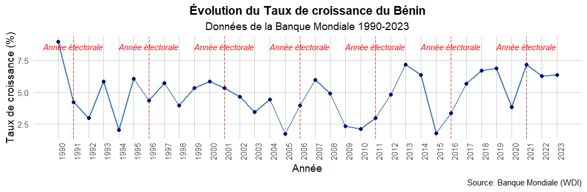
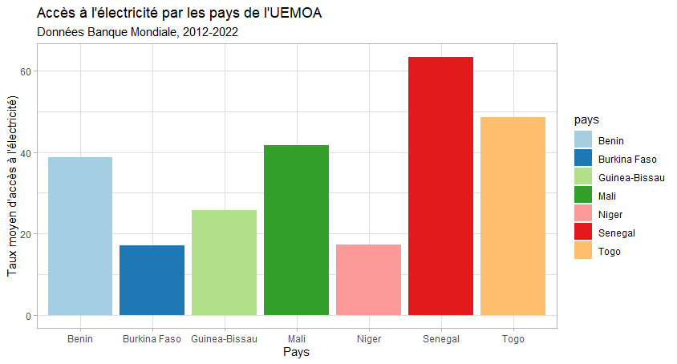
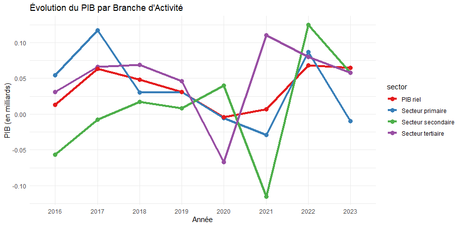

## What is the Economic Policy Management (GPE) training programme?

The Economic Policy Management (GPE) training programme is a leading French course for developing public economic capacity in stakeholders from developing countries, with a particular focus on French-speaking countries in sub-Saharan Africa. It leads to a Master 2, a national diploma delivered by the University of Clermont Auvergne (UCA). 

## What was the course about?

The objective of this course was to equip them with the skills to utilise R programming for data analysis and visualisation, including basic statistics and visualisation. The final course comprised an exercise in which they selected a key data set related to their field of expertise to highlight. In only 18 hours discovering this tool, they manage to get some remarquable progress! here are some of the results:

|  |  |  |
|:--:|:--:|:--:|
| *Graphs by Bio Bertrand Mama* |*Akouvi Sophie Agbavo* | *and Biri Salatou Diagana* |
