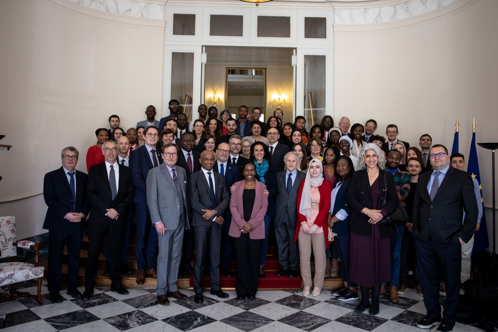

## A new centre for development and development activities

This event marked the official launch of a new centre of excellence in Clermont-Ferrand, bringing together CERDI, Ferdi and the Global Development Network to develop solutions for developing countries and bring together academic researchers, policy makers and project implementers. I am proud to be part of this laboratory. 

## A day full of meetings

This event was full of insightful interventions, speeches and meetings. I had the opportunity to discuss their vision of development policy and climate action with many senior officials from the French Ministry of Finance, the French Development Agency and, of course, Chrysoula Zacharopoulou, Minister of State for Development and International Partnerships, attached to the Minister of European and Foreign Affairs.

Photo by [Jonathan Sarago](https://www.linkedin.com/in/jonathan-sarago/)
