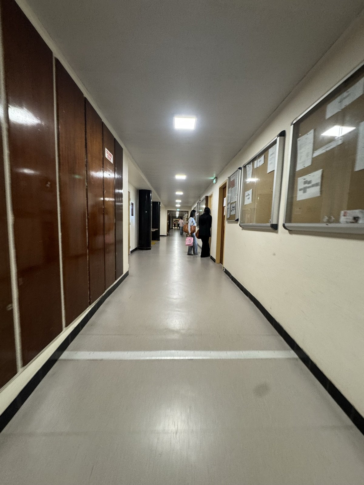
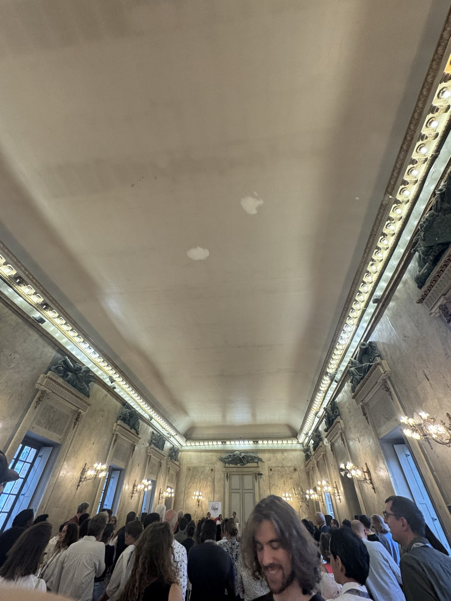
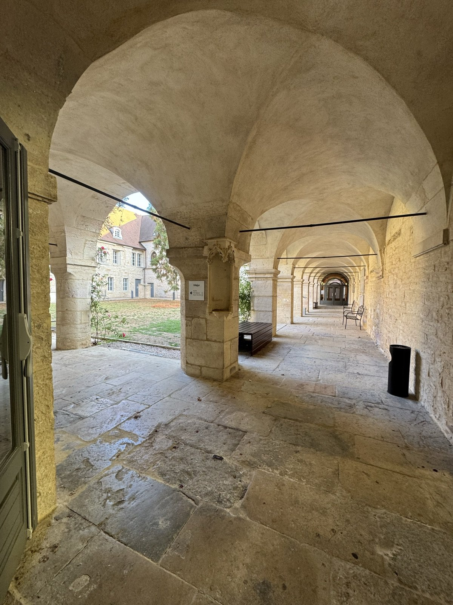

This week I presented at the **13th Annual Conference of the French
Association of Environmental and Resource Economists**
([FAERE 2026](https://faere2026.sciencesconf.org/), 10–11 September),
hosted by **[Université Bourgogne Europe](https://www.ube.fr/)** and
organized by the [LEDi](https://ledi.ube.fr/) and
[CESAER](https://cesaer.dijon.hub.inrae.fr/).

This conference was special to me for a reason that has nothing to do
with the programme. Dijon is where I started the first two years of my
bachelor in economics, and the sessions took place in the very building
where I attended my very first lecture. Coming back there as a PhD
candidate, to present my own research, was a small full-circle moment.

## The paper

I presented **"Development Goals, Emissions Costs? Climate and
Development Finance vis-à-vis Local CO₂ Emissions"**
([more here](/research/#development-goals-emissions-costs)) in the
session *Environment and Trade for Developing Countries*, on Friday
morning. First slot, 9:00, sharp start.

The session itself had a remarkably coherent line-up, which made the
discussions easy to build on: **[Chloé
Antoine](https://www.chloeantoine.fr/)** (CREST) presented *Agriculture,
Trade and Biodiversity* right after me, and **Ariane Amin** closed the
session, presenting joint work with **Morié Guy-Roland N'Drin** on
climate finance and energy–emissions efficiency in West Africa —
development finance and emissions again, from another angle.

## Thanks, Chloé

A special thanks to **[Chloé Antoine](https://www.chloeantoine.fr/)**,
who commented on my paper and gave me detailed and encouraging
feedback.

She also made me discover
[websitecarbon.com](https://www.websitecarbon.com/), which estimates
the CO₂ emitted when a page loads. I obviously ran the test on [this
very website](https://pierrebeaucoral.github.io/) — and the result led
me to give it a proper carbon overhaul: self-hosted subset fonts,
lighter pages, and a carbon disclaimer in the footer. An environmental
economics conference that ends with a smaller website footprint is
exactly the kind of spillover I am happy to report.

## Back to Amphi Proudhon

Between sessions I walked again through the wood-panelled corridors of
the faculty, past the same old noticeboards. And of course I had to
stop in front of the doors of **Amphithéâtre Proudhon** — the very
first amphitheatre I ever sat in, back when I knew nothing about
economics except that I wanted to study it. A few years later, I was
back a few doors away, presenting research of my own. If someone had
told the first-year student in that amphi that this is where it would
lead, I am not sure he would have believed it.

*The corridors of the faculty — some things do not change.*

## The Palais des Ducs

We were also treated to a memorable social programme: the conference
reception was hosted at the **Palais des Ducs de Bourgogne**, in the
*Salle de Flore* — marble, chandeliers, and a crowd of environmental
economists under a ceiling that has seen a few centuries of history.

*The Salle de Flore during the reception.*

And Dijon itself did the rest: medieval arcades, pastel facades, and
that particular art of living that makes every detour feel like a
postcard. Hope to be back for the next one !

*Dijon, between two sessions.*

## Merci, Dijon

My sincere thanks to the organizing teams at LEDi and CESAER, and to
Université Bourgogne Europe for hosting — and for letting a former
student come home for two days.
