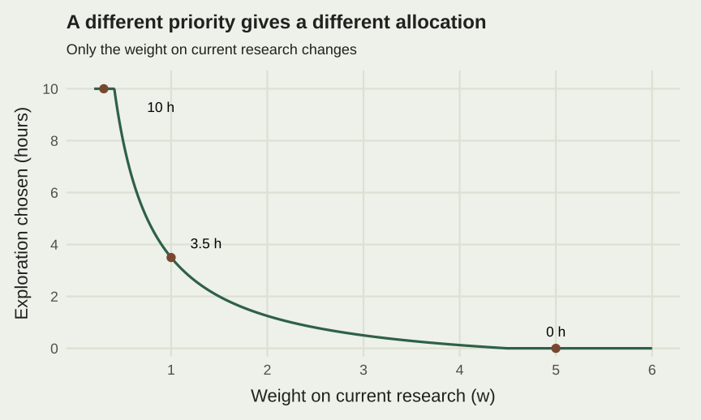
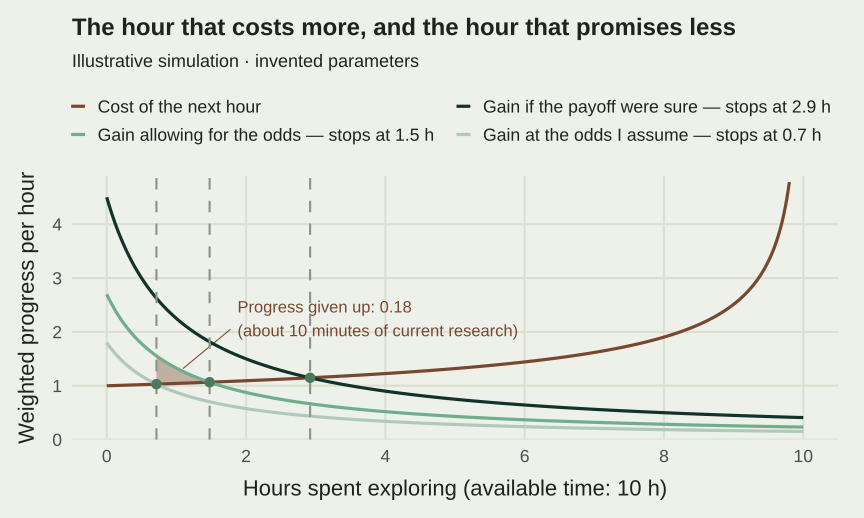
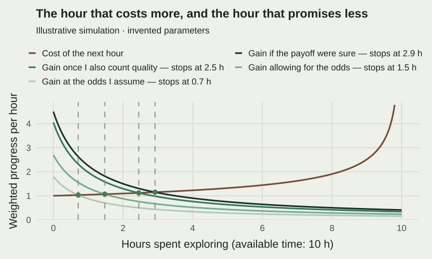

I like making educational content and small tools because I learn things
while building them. I discover a technique, try to understand how it
works, and end up with something someone else can use. It is a way to
stay current and develop skills, with a concrete reason to finish what
I started.

Finding the time is harder. Teaching needs preparing. Existing research
needs moving forward. There is almost always a sensible answer to the
question of what I should be doing instead. If exploration gets whatever
time remains, I worry that it will gradually disappear from my working
life.

I also know the opposite temptation: learning something new can be much
more appealing than returning to a difficult paper. I want room for
curiosity, and I want to finish my research. So I made a small model to
think through that tension.

## The time available

Imagine a block of  hours left after required teaching and other
obligations. I allocate  hours to exploration, leaving  for
current research:



Exploration could mean learning a method or developing a teaching tool
beyond what is required. The distinction is deliberately simplified:
ordinary research and teaching are also ways of learning.

Let  be my current research progress per hour,  the weight
attached to current work,  the research hours available in a later
period, and  the weight attached to that future:



Both periods have fixed time budgets. An hour spent exploring today has
an opportunity cost: I forgo  units of immediate research progress,
valued at .

## What I get from a detour

Suppose exploration adds to future productivity through this learning
curve:



Here  describes how much useful productivity learning can add, while
 sets the time scale. The logarithm imposes diminishing returns: each
additional hour contributes less than the previous one. That is an
assumption I can inspect and change.

There is a second assumption hidden in writing it this way, and it is
the one I find harder to defend: the curve treats the payoff as certain.
I put in the hours, the skill arrives, it helps next year. My actual
experience is less obliging. Some detours transfer completely, some
turn out to be interesting and useless, and a few matter in a way I
could not have predicted when I started.

So the honest version of that curve is the payoff a detour delivers
**if** it transfers. What I actually face is a bet: the same hours, an
uncertain multiplier on the result. That changes what the calculation
has to compare — an average outcome rather than a promised one, and an
average I should treat with some suspicion, because I only get to run
this particular afternoon once.

I also let a fraction , between zero and one, of existing
productivity fail to carry over to the next period. Future productivity
therefore combines the retained baseline, , and the learning
gain, .

The objective adds weighted progress today and discounted progress later:



The units are worth spelling out. , , , and  are hours;
 and  are progress per research hour. The remaining parameters
are dimensionless. The resulting objective is a constructed index of
research progress. It leaves the pleasure of learning and the value of
teaching materials outside the calculation.

## Where would I stop?

The useful comparison concerns the next hour, and two things move against
each other as exploration grows. The cost of an hour rises: the first hour
I take comes out of the least urgent corner of the afternoon, the last one
comes out of the work I can least afford to leave. The benefit of an hour
falls: the tenth hour of a new method teaches me less than the first.
Somewhere between the two, they meet, and that point is where I stop.

The benefit in that comparison is not the payoff a detour delivers when it
lands. It is that payoff weighted by the chance it lands at all, and marked
down again because a gain I might get is worth less to me than the same gain
in hand. Both markdowns pull the crossing to the left. Neither changes
whether I explore at all: the first hour either looks worth taking or it
does not, and caution has no grip on that decision, only on how far to carry
it.

In the invented example behind that figure, the crossing sits at **2.9 hours**
when the payoff is treated as certain, and at **1.5 hours** once it is treated
as a bet with a six-in-ten chance of transferring, valued with some caution
about the spread. Keeping the cost of an hour flat instead, so that the whole
calculation has a closed form, the odds alone take the stopping point from
**3.5 hours to 1.7**, caution about the spread moves it a little further left
again, and believing the chance is four in ten rather than six would take it
to **0.8**.

If the payoff were certain and the cost of an hour flat, the comparison
reduces to the version I can write out cleanly. Differentiating gives:



When , that objective is strictly concave. The future gain from
another hour falls as exploration increases, so an interior solution is
unique. Setting the first derivative to zero gives:



That answer still has to fit within the available time. Define:



Then the constrained optimum is:



If the first hour's future benefit is already below its cost, the model
chooses zero exploration. If even the last available hour pays for itself,
it chooses the whole block. Otherwise, it stops at the interior crossing.
When , current research takes the whole block; when ,
there is simply no time to allocate.

The retained productivity term is constant in . As a result, changing
 shifts the level of the objective but leaves this optimum unchanged.
Making skill obsolescence change the allocation would require another
mechanism.

## Why the answer changes from one situation to another

Inside the interior region, more future research time, a higher weight on
the future, or more effective learning increases exploration:



Greater urgency or productivity in current research raises the
opportunity cost of a detour. A larger learning time scale reduces its
marginal return:



These derivatives apply while the solution stays inside the time
constraint. At a corner, a parameter can change without changing the
chosen allocation.

The table and figure below step back to the obliging case — a flat cost
per hour and a detour certain to pay off — because that is where the
closed form lives, so the corners can be shown exactly rather than read
off a crossing. The section after returns to the bet, and asks whether I
am misreading it in two different ways.

For an illustration, I use the following invented settings:



Varying only the current-work weight gives:

| Relative urgency |  | {{< model-inline "e^{\mathrm u}" >}} |  | |
|---|---|---|---|---|
| High | 5 | −0.1 | 0 | lower corner |
| Medium | 1 | 3.5 | 3.5 | interior |
| Low | 0.3 | 14 | 10 | full exploration |

The baseline choice is 3.5 hours out of ten. The two other settings show
why the same model can justify either concentrating entirely on current
research or spending the available block exploring. These numbers follow
from the assumptions. I have no estimate that would turn them into a
recommendation for my actual week.

## What if I am undervaluing the detours?

I can see the section of a paper I did not write this afternoon. It is
harder to see the better question I might ask next year because I took
time to learn something today. There are two ways that asymmetry could
be leading me astray, and they are different mistakes.

The first is the odds. I rarely doubt that a technique would help me if
it landed; I doubt that it will land. Suppose I give a detour two-thirds
of the chance it really has — four in ten, when the truth is six. That is
one more falling curve on the same axes, sitting below the others, and it
stops me at **0.7 hours** instead of 1.5.

The shaded band is what that mistake costs: the progress the hours between
the two crossings would have added, over and above what they cost. It comes
to **0.18** in the units of this index — about **ten minutes** of current
research, and under **one percent** of the objective at the true stopping
point.

That number deserves to be read honestly, because it undercuts the worry
that prompted the whole exercise. Misjudging the odds by a third nearly
halves the time I give to exploring, and still costs me almost nothing.
Near the crossing the two curves are almost touching, so the hours in
dispute are hours that barely pay their way in either direction: being
somewhat wrong about them is cheap. The expensive mistakes would be much
larger ones — treating a detour as hopeless when it is even odds, or
clearing the week for one that will not transfer. That is the model's
answer, and it is more modest than the question I asked it.

The second way of undervaluing a detour is about the size of the payoff
rather than its odds. So far, learning improves a single productivity
index. But a technique could help me produce **more research**, and it could
improve **the quality of that research**: a stronger design, better checks,
or a clearer explanation. Counting only the work I can produce faster
could miss part of the return.

To make that possibility explicit, write  and
separate two future outcomes:



 is a volume/progress index, with  recovering the
original channel.  is an additional quality-related contribution,
measured relative to a fixed baseline. It represents an aggregate
contribution to the work; average quality per paper would require a
different specification. Both coefficients are nonnegative.

For example, a better workflow might save time, while a new diagnostic
might improve the credibility of an analysis. The two channels should
capture distinct benefits. Counting the same improvement twice would
exaggerate the case for exploration.

Let  express how I value the quality contribution in
progress-equivalent units. The fuller objective becomes:



With  and , the payoff a detour delivers when it
lands is half again as large as the quantity channel alone, .
That lifts the benefit curve, and the crossing with it, to **2.5 hours**:

Writing  for the share of that combined payoff I act on, and keeping
the two readings of it together, the objective guiding my choice is:



Underestimating the odds of a payoff and underestimating the size of a
payoff I am sure to get turn out to be the same arithmetic here, which
is why one symbol covers both readings. The time horizon and discount
factor stay the same. All of this assumes the fuller valuation is the
correct one; whether it is, in my work, stays an open question.

The recognised-return choice and the fuller-valuation choice are:



Because the clipping function is increasing, . When both
choices are interior, the gap is:



The choices can coincide at a corner. Under-recognition therefore does
not always change how much time is allocated.

The two future outcomes respond to exploration as follows:



When the respective learning coefficients and future hours are positive,
a larger allocation raises both future indices. Current progress falls
by . Evaluating both choices with the same fuller
objective gives , with a strict gain when the choices
differ. That conclusion follows from the assumed objective and its unique
maximum.

In the flat-cost version that has a closed form, recognising two-thirds of
the combined return rather than all of it moves the allocation from **5.75
hours to 3.5**, and immediate progress the other way, from **4.25 to 6.5**
units. Their signs reflect the production functions I chose, and their size
reflects fictional parameter values.

## What I take from this

The hardest part remains judging the odds. Writing a probability into
an equation is easy; knowing what it should be for the specific thing I
am tempted to spend Thursday on is the whole difficulty, and the model
offers no help with it.

One warning falls out of treating detours as bets. A few of them pay off
enormously — the technique that redirects a project, the tool someone
else picks up — and averages are easily dragged upward by outcomes that
rare. A plan talked into a large allocation by one spectacular
possibility is a plan resting on an average I will probably never see.
This is a version of an old puzzle sometimes called the St Petersburg
paradox, and the practical lesson I take from it is modest: be careful
with a case for exploring that depends on the best imaginable outcome.

I also care about the pleasure of making things and the possibility
that a detour changes the question itself. The model captures only part
of that experience. Its two periods are too simple to decide whether a
weekly learning slot or an exploratory phase between projects would suit
me better.

What it gives me is a question to ask before dismissing a detour: have I
considered what it could make possible, or mostly counted the work I can
see it delaying? I would like to leave room for that question while still
giving the papers on my desk the attention they need.

A [short visual carousel](/uploads/learning-detours/learning-detours.pdf)
walks through the intuition.
